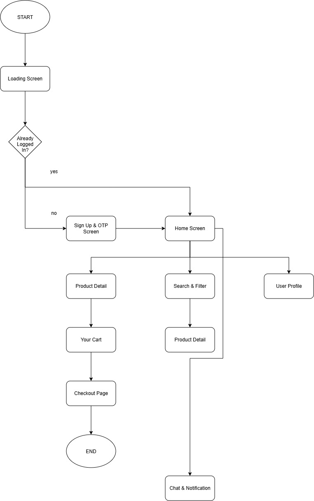

# Tokopedia UI Clone - Flutter

Project ini dibuat untuk memenuhi tugas UTS Pemrograman Mobile. 

Aplikasi ini merupakan clone UI Tokopedia yang dibuat menggunakan Flutter.

## Anggota Kelompok

- Sabrina Clarissa Hendra - 535250112
- Nama - NIM
- Nama - NIM
- Nama - NIM
- Nama - NIM

## Pembagian Tugas

- **Home & Splash/Loading Screen** - Sabrina
- **Product Detail** - Nama
- **Cart & Checkout** - Nama
- **Search & Wishlist** - Nama
- **Profile, Auth & Core** - Nama

## User Flow

## Teknologi

- Flutter
- Dart
- Android Studio
- Github
