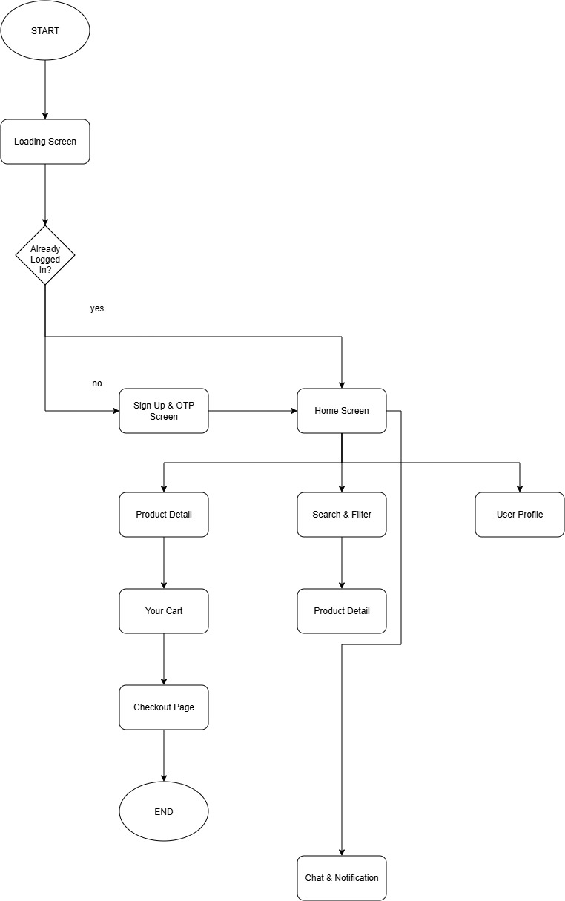

# Tokopedia UI Clone - Flutter

Project ini dibuat untuk memenuhi tugas UTS Pemrograman Mobile. 

Aplikasi ini merupakan clone UI Tokopedia yang dibuat menggunakan Flutter.

## Anggota Kelompok

- Sabrina Clarissa Hendra - 535250112
- Yohana Pardede - 535250105
- Valencia Chen - 535250123
- Aurelia Cheryl Claresta - 535250104
- Jasmine Malvina - 535250126

## Pembagian Tugas

- **Home & Splash/Loading Screen** - Sabrina
- **Product Detail** - Yohana
- **Cart & Checkout** - Jasmine
- **Search & Wishlist** - Valencia Chen
- **Profile, Auth & Core** - Aurelia

## User Flow

## Teknologi

- Flutter
- Dart
- Android Studio
- Github
